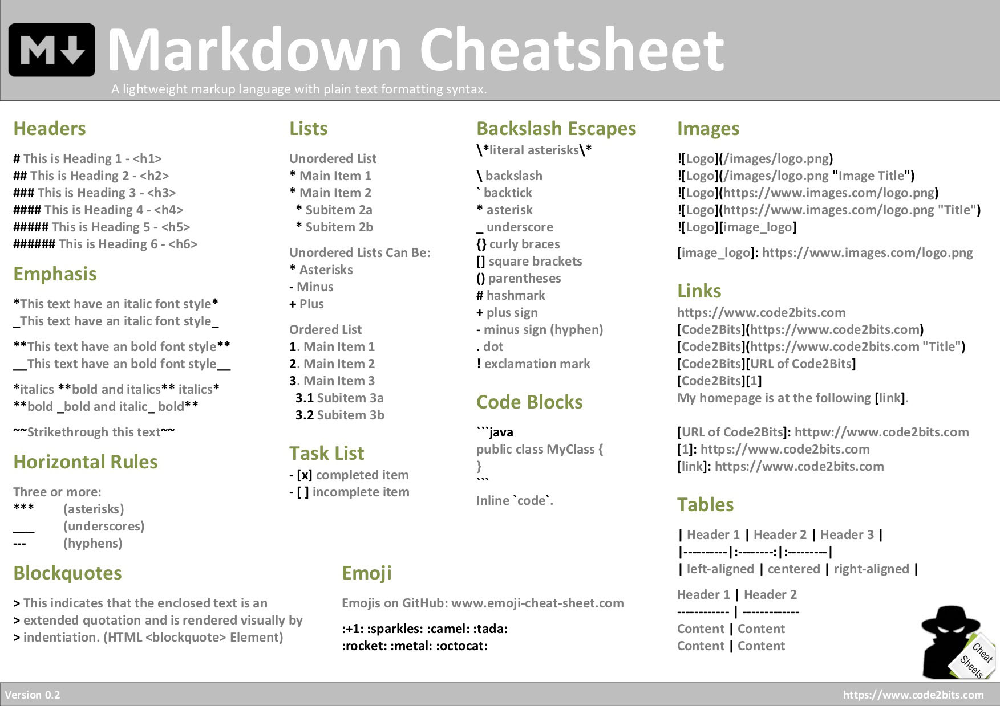

# Markdown

[[Языки разметки#Облегчённые языки разметки | Облегченный язык разметки]] для форматирования текстов с сохранением
читаемости.

---

##       * Уровин заголовков

### Heading 3

#### Heading 4

##### Heading 5

###### Heading 6
---

##       * Акценты

*Текст курсивом*
_Текст курсивом_
**Жирное написание**
__Жирное написание__
~~Зачеркнутое написание~~

---

##       * Горизонатальные линии

*** 
___
---

##       * Цитирование

> Расширенное цитирование
>> Вложенное цитирование 1
>
>> Вложенное цитирование 2
---

##       * Списки

### Неупорядоченные

* Item 1
    * Subitem 1a
        * SubSubitem 1aa
* Item 2

#### Неупорядоченные могут быть:

* (*) Звездочка

- (-) Минус

+ (+) Плюс

---

### Упорядоченные списки

1. Оден
    1. Полтора
2. Тва
3. Три
4. Четыре сыра

---

## Чеклист

- [x] Готово
- [ ] Не готово

---

## Эможди

🖥 🚆

* можно брать [здесь](https://www.webfx.com/tools/emoji-cheat-sheet/)
* можно плагином в идее [cmd + shift + space]

---

## Картинки

* 
    * [cheat sheet 1](../resources/Markdown Cheatsheet.png)
* 
    * [cheat sheet 2](https://media.cheatography.com/storage/thumb/lucbpz_the-ultimate-markdown.600.jpg)
* ![cheat sheet 3][cheat_sheet_3]
  
[cheat_sheet_3]: https://i.pinimg.com/originals/aa/3f/81/aa3f81e32937c5ab7571f006fb2f5bd4.png

---

## Ссылки

* [Ссылка 1](https://i.pinimg.com/originals/aa/3f/81/aa3f81e32937c5ab7571f006fb2f5bd4.png)
* [Ссылка 2](https://i.pinimg.com/originals/aa/3f/81/aa3f81e32937c5ab7571f006fb2f5bd4.png "описание")
* [Ссылка 3][link]
* Ссылка 4 [link]
  [link]: https://i.pinimg.com/originals/aa/3f/81/aa3f81e32937c5ab7571f006fb2f5bd4.png 
---
## Таблицы

* Таблица с заданным выравниваием

| Стоб 1 | Header 2 | Header 3 |
|----------|:--------:|-------:| 
| left | center | right |

* Таблица c дефолтным выравнивание по левому краю

Столбец 1 | Заголовок 2
-----------|----------
Содержимое | Содержимое