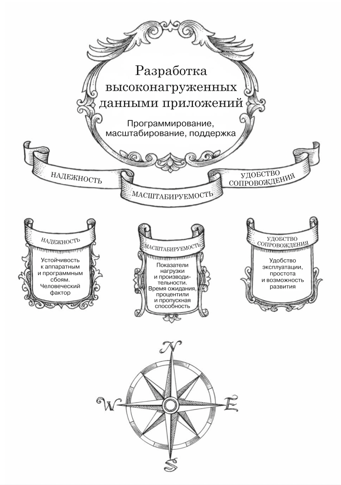

# Высоко-нагруженные приложения

```
Прогарммирование
Масштабирование
Поддержка
```
---
## Предисловие

* Лидеры индустрии обрабатывают растущие объемы данных
  * как следствие создают новые инструменты решения проблем.
* Коммерческие компании вынужденные быстро реагировать
  * проверять гипотезы минимальными затратами
  * сокращать циклы разработки
  * делать гибкие модели данных
* Свободное ПО предпочтительнее коммерческим и внутреннего использования
* Даже небольшие команды могут создавать распределенные системы благодаря этим инструментам
* Работа сервисов стала более стабильно
  * простои все менее приемлимы

### Отличие приложений ВЫСОКОНАГРУЖЕННЫХ ДАННЫМИ от ВЫСОКОНАГРУЖЕННЫХ ВЫЧИСЛЕНИЯМИ

* DIA(data-intensive applications)
  * данные представляют основную проблему
    * качество
    * степень сложности
    * скорость изменений
* CIA(compute-intensive applications)
  * узкое место - CPU
  
---

## Часть 1. Основы информационных систем.

### 1. Надежные, масштабируемые и удобные в сопровождении приложения

* Примеры функциональностей которых требует DIA
  * хранение данных чтобы их можно было найти самим и другим приложениям (базы данных)
  * запомнить результат ресурсоемкой операции для ускорения чтения (кэши)
  * поиска данных по ключевому слову или фильтрация (поисковые индексы)
  * отправка сообщения другим процессам для ассинхронной обработки (потоковая обработка)
  * время от времени обрабатывать большие объемы накопленных данных (пакетная обработка)

#### 1.1 Подходы к работе над информационными данными

