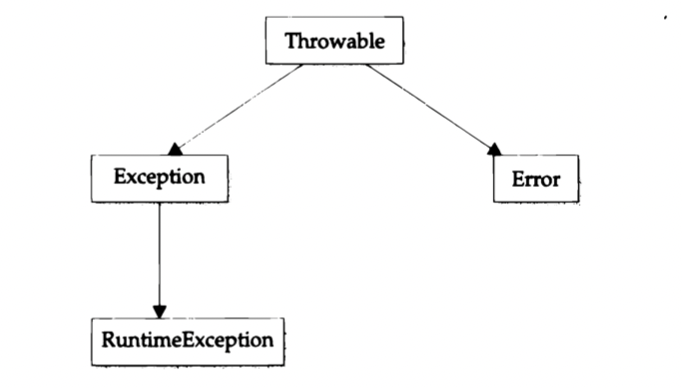
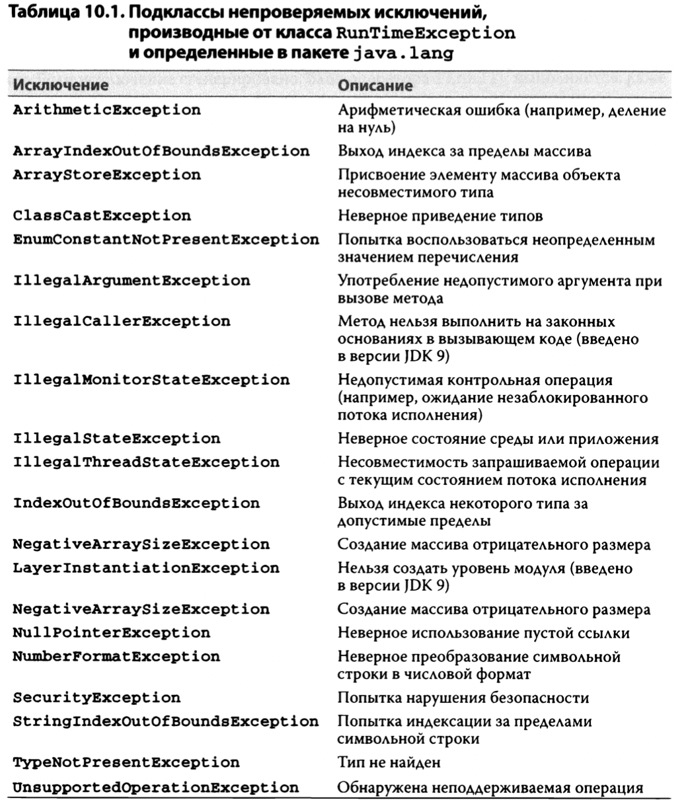
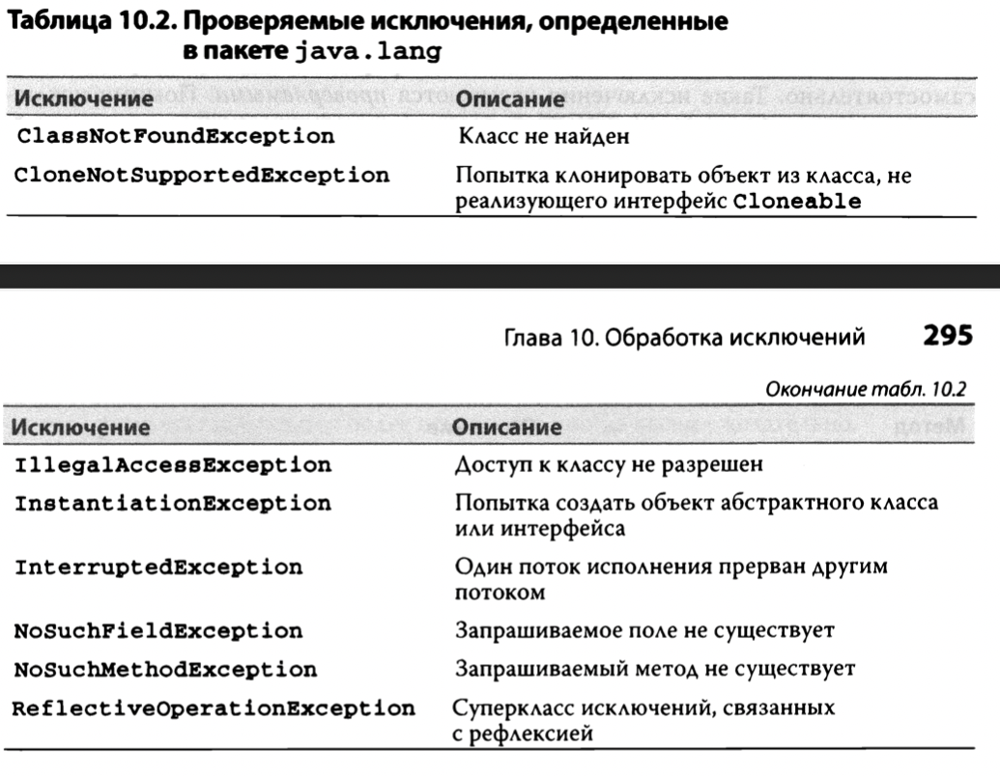
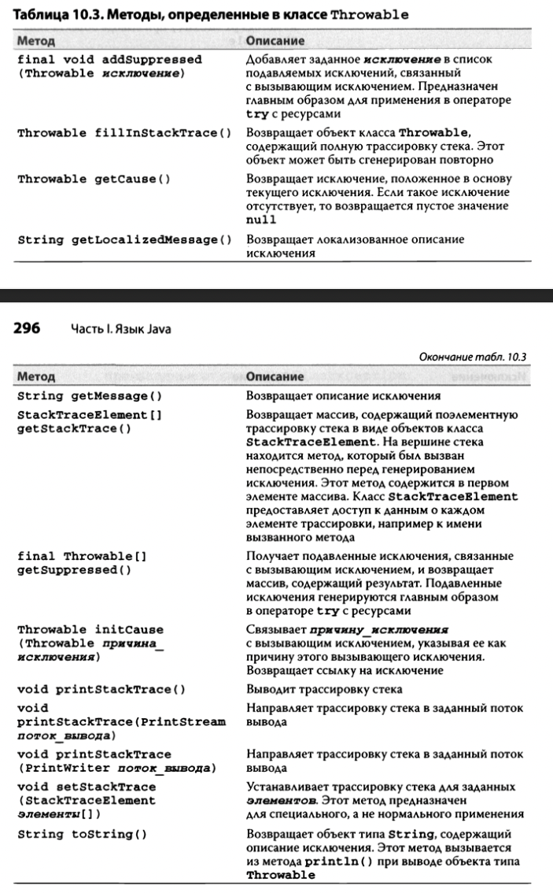

# Классы и методы

## Перегрузка методов

`@Overload`

- одного имя для разных методов
- должны отличаться набор параметров

---

## Рекурсия

- плодит стеки при каждом вложенном вызове
- черевато StackOverflowError

---

## Управление доступом

### `Private`(только для членов и вложенных классов)

- член/класс доступен только другим членам этого же класса

### `Public`

- член/класс доступен везде

### `Protected`(только для членов и вложенных классов)

- член доступен всем наследникам

### `Default` (`PackageLocal`)

- член/класс доступен только в пакете

---

## `Static`

- Член доступен из класса (глобальные)
- Переменные класса
    - Все экземпляры ссылаются на один и тот же член
- Методы
    - Могут обращаться только к статическим членам
- Никак не могут ссылаться на `this` и `super`
- Если инициализация требует вычислений, используется статический блок

```
class UseStatic {
    static int а =3; static int Ь;
    
    static {
        System.out.println("Статический блок инициализирован.");
        Ь = а * 4;
    }
}    
```

---

## `Final`

- предотвращает изменение содержимого
- инициализируется
    - inline
    - в статическом блоке
    - в конструкторе
- могут быть
    - поля
    - методы
    - локальные переменные

---

## Вложенные классы

- один класс определен в другом
- область действия вложенного ограничена областью внешнего класса
    - `B` вложен `A`. `B` может существовать только как `A.B`
- вложенные класс имеет доступ к членам класса в который он вложен
    - в тч и `private`
- появились в `Java 1.1`

### Статический вложенный класс `static`

- может обращаться только к статическим членам внешнего класса

### Нестатический вложенный класс (Внутренний)

- доступны все члены внешнего

```
class Outer {
  int outer х = 100;
  
  void test() {
    // Inner может быть создан только в контексте классаOutеr
    Inner inner = new Inner(); 
    inner.display();
  }

  class Inner {
    void display () {
      System.out.println("вывoд: outer_x " + outer_x);
    }
  }
}

class InnerClassDemo {
  public static void main (String args []) {
    Outer outer = new Outer();
    uter.test();
  }
}

// вывод: outer_x = 100
```

---

## `String`

- любая символьная строка - String
- final
- определены методы
    - equals() - сравнивает строки посимвольно
    - charAt() - символ по индексу
    - length() - длина символьной строки

---

## Аргументы переменной длины `varargs` (done)

- `тип имя_метода(тип ... имя_параметра)`
    - реализация - массив `тип[]`
    - можно вызывать без параметров вообще
        - `имя_параметра.length() == null`
- можно перегружать
- ограничения
    - параметр переменной длины указывается последним в списке параметров
        - `int doit(int а, int Ь, douЬle с, int ... vals)`
    - только один параметр переменной длины на метод
    - неоднозначность при перегрузке

```
static void vaтest (int ... v) { // ...
static void vaTest(int n, int ... v) { // ...
// компилятор не поймет вызов vaTest(1), vaTest(1, 2) и тд
```

---
---

# Наследование

`ПОДКЛАСС extends СУПЕРКЛАСС`

## Доступ к членам класса

- `private` члены супера остаются закрытыми
- последовательность вызова конструкторов в иерархии
- переменная суперкласса может содержать ссылку на подкласс
    - `Sup a = new Sub();`

## `super` (done)

Нужен для ссылки из подкласса на суперкласс

- на члены суперкласса (метод или поле)
    - аналогично `this.id = id`
    - имена членов подкласса скрывают(совпадают) члены суперкласса
    - `super.членКласса()`

- на конструктор суперкласса
    - `super(список аргументов)`
    - если конструктор в подклассе переопределен и не содержит вызова `super(список аргументов)`
        - под капотом вызывается дефолтный конструктор `super()`
    - для иерархии
        - `superSuper() -> super() -> subclass()`

## Переопределение методов `@Override`

- метод подкласса переопределяет метод супера, если их сигнатуры полностью совпадают
- неопределенность если у методов совпадают имена и параметры, а возвращаемый класс нет

## Динамическая диспетчеризация методов (Runtime)

- реализация runtime полиморфизма

```
SubClass b = new SubClass()
SuperClass a = b

// a.уникальныйМетодДляКлассаB(); Ошибка компиляции
a.общийМетод(); // вызовет последнюю реализацию подкласса
```

- Набор членов определяется классом переменной
- Реализация определяется классом объекта который в переменной

## Абстрактные классы

- `модификатор доступа abstract class ИмяКласса;`
- чтобы задать суперкласс с определенной структурой, но без полной реализации
- может содержать дефолтный методы
- может содержать абстрактные методы
    - `abstract тип имя(список_параметров);`
- или вообще без методов
- нельзя сделать экземпляр
- может иметь реализацию конструктора

## `FINAL`

* Предотвращение переопределения
* Предотвращение наследования

---

# Пакеты и Интерфейсы

## Пакеты

* Инструмент управления пространством имен

### Определение пакета

* указать в начале файла `package "имя пакета"`
* для хранения - одноименная иерархия файловой системы
* внутри лежит файл .class

### Поиск пакетов и переменная окружения CLASSPATH

* по умолчанию Java использует текущий рабочий каталог
    * если пакет находится в подкаталоге текущего каталога, он будет найден
* в `CLASSPATH` можно указать один или несколько путей к каталогу
* можно указывать при запуске параметр `-classpath`, обозначающим путь к классам

### Доступ к пакетам и его компонентам

| | private | package local | protected | public |
|----------|:--------:|:-------:|:-------:|:-------:| 
| Один и тот же класс | да | да | да | да |
| Подкласс, производный от класса | нет | да | да | да |
| Класс из того же самого пакета, не являющийся подклассом | нет | да | да | да |
| Подкласс, производный от класса из другого пакета | нет | нет | да | да |
| Класс из другого пакета, не являющийся подклассом, производным от класса из данного пакета | нет | нет | нет | да |

* почему в конструкторе
* конвенция нейминга пакетов
    * разделять точками больше 2х слов

## Интерфейсы

* отличаются от абстрактных классов
    * иерархией
    * ИФ не способны хранить данные состояния
        * нет переменных класса
        * переменные дефолтно `public static final`

### Назначение

[Как я понял]

1. чтобы определить общее правило для взаимодействия
    1. абстрагироваться от реализаций полностью

### Объявление интерфейса

* Модификатор доступа: !!! Важно !!! Не относится к встроенным ИФ
    * сам интерфейс
        * package local
        * public
    * методы (как абстрактные только без "abstract")
        * писать не нужно

### Реализация интерфейсов

* реализующие методы `public`
* сигнатура должна совпадать с сигнатурой в ИФ

### Доступ к реализациям через ссылки на интерфейсы

* аналогично использованию ссылки на суперкласс для доступа к подклассу

### Частичные реализации

* абстрактные классы могут **частично** реализовывать или вообще **не реализовывать** методы интерфейса

### Вложенные интерфейсы(интерфейс **член**)

* Мб объявлен
    * в классе
    * в другом ИФ
* Модификаторы
    * public
    * private
    * protected

### Переменные в интерфейсах

* `int a` === `public static final int a = 1`
    * Обязательно должны быть определены
    * переопределение недопустимо
    * по-дефолту `public` и **только**
    * вне реализующего класса доступ через имя ИФ
* импорт констант для повторного их использования в другом пространстве имен классов (типа как ЕNUM)
* не знаю где это стоит использовать

### Расширение ИФ

* через ключевое слово `extend` аналогично наследованию

### Методы с реализацией по умолчанию

!! До JDK8 в интерфейсах не было реализаций **ТРАДИЦИОННАЯ ФОРМА**
!! С JDK8 в интерфейсах + методы с реализаций по умолчанию

* Причины появления
    * средство для расширения интерфейсов без нарушения уже существующего кода
        * простой способ обеспечить обратную совместимость
    * чтобы добавить **по существу необязательные методы**
        * ???

#### Применение

* определение
    * `default String getString() {...}`
    * `default` - модификатор доступа
        * аналогично `public`

### Множественное наследование

#### Конфликты с дефолтными методами

* приоритет в первую очередь реализации в классе
* класс реализует 2 ИФ с одинаковыми по сигнатуре дефолтными методами
    * переопределить в классе
        * нет ошибки
    * оставить как есть
        * ошибка
* В случаях расширения ИФ с одинаковыми по сигнатуре дефолтными методами
    * приоритет наследующему ИФ
    * если в наследующем ИФ нужен доступ к реализации в наследуемом ИФ используется специальная форма обращения
        * `имя_наследуемого_интерфейса.suреr.имя_метода()`

### Статические методы ИФ (с JDK8)

* без модификатора доступа
    * всегда `public`
* не наследуется реализующим классом
* не наследуется при расширении другого ИФ

```
static int getDefaultNumber() {
  return О;
}
```

### Закрытые методы интерфейсов (с JDK9)

* вызывается из метода по умолчанию
* всегда `private` и это нужно указывать
* служит для логического разделения методов и переиспользования кода

---

# Обработка исключений

## Основы обработки

* Исключение в Java - объект описывающий ошибочную ситуацию в коде
* Объект исключения генерируется в вызвавшем ошибку методе
    * Метод может сам обработать или пропустить наружу

### Природа ошибок

* Могут генерироваться автоматически в исполняющей системой Java
    * ошибки нарушения привил языка
    * ошибки связанные с ограничениями исполняющей системы Java
* Генерируемые вручную
    * для уведомления вызывающего кода об ошибках

Ключевые слова для управления обработкой исключений

```
try - блок отслеживания исключений
catch - блок перехвата исключений
throw - генерация исключения
throws - ожидаемое, но не обрабатываемое исключение нужно объявлять в сигнатуре метода с этим ключевым словом
finally - блок который должен выполнятся после try
```

## Типы исключений



* все наследуют класс `Throwable`
    * `Exception` - должна перехватывать прикладная программа. Своих методов не имеет, наследует от `Thwrowable`
        * RuntimeException - автоматически определяются /0, index out of bound...
    * `Error` - ошибки исполняющей среды (StackOverflow) - как правило для аварийных сбоев

## Необрабатываемые исключения

* перехватываются стандартным обработчиком java
    * он возвращает в стандартный аутпут "имя" исключения, описание и стектрейс
    * прерывает программу

## Для чего обрабатывать исключения

1. Возможность исправить ошибку
2. Избежать прерывания

## Вывод описания исключения

* `Throwable` переопределяет метод `toString()`
    * автоматически вызывается там где требуется `String`
        * `System.out.println("Исключение: " + exception);`

## Несколько `catch`

* важно соблюдать последовательность `от подклассов к суперклассам` сверху вниз
    * иначе будут недостижимые блоки и приложение не скомпилируется

## Вложенные `try`

* перехват исключения изнутри во внешнюю область видимости

## Оператор `throw`

- команда для проброса исключения
- !! Важно пробрасываемый объект должен быть подклассом `Throwable`
- последующие действия не выполняются в этой области видимости
    - **поток** выполнения останавливается после `throw`
    - проверяется на наличие `catch` подходящего нашему типу исключения
    - если не находит, передается стандартному обработчику
        - он прерывает программу
- можно пробрасывать уже пойманные экземпляры исключений
    - `throw exception`
- можно создавать и пробрасывать свои экземпляры
    - `throw new NullPointerException("descriton")`

## `Проверяемы` и `непроверяемые`

## № Разница или принцип деления на отслежиаемые и не

???

## Оператор `throws`

- чтобы определить что метод может генерироваить исключения которые сам не обрабатывает
    - нужно чтобы обезопасить вызывающий код
- обязательно для всех исключений кроме `непроверяемых`
    - `RuntimeException` и подклассы
    - `Error` и подклассы
- иначе ошибка при компиляции

```
тип имя_метода(список_параметров) throws список_исключений {
 тело метода
}
```

## Оператор `finally`

* будет выполнен по завершении блока `try/catch`
* будет выполнен даже если в `try` `return`
* будет выполнен даже если исключение из блока `try` не будет обработано
    * удобно закрывать дескрипторы или осовбождать рессурсы
* не обязателен, если есть `catch`
* обязателен, если нет `catch`

## Встроенные в Java исключения




## Создание собственных исключений

* достаточно унаследовать `Exception`
    * определяются 4 конструктора
        * Exception()
        * Exception(String message)
        * еще 2 наследуются от `Throwable` он них ниже
* в самом классе можно ничего не реализовывать
  

## Цепочка исключений (JDK1.4)

- позволяет связать одно исключение с другим
- в `Throwable` 2 конструктора для этого
    - `Throwable(Throwable причина_исключения)`
    - `Throwable(String сообщение, Throwable причина_исключения)`
- Для этого же методы:
    - `Throwable getCause()`
        - возвращает причину текущего исключения
    - `Throwable initCause(String сообщение, Throwable причина_исключения)`
        - связывает
        - !!! `cause` не может быть переопределен методом `initCause`, если уже был объявлен
- Глубина цепочки может быть любой
    - но длинные цепочки - скорее всего ошибка проектирования

## Дополнительные средства для обработки исключений

* с JDK7
    * `try с ресурсами` - для освобождения файлов
    * `многократный перехват`
        * перехватывает несколько исключений ```catch(ArithmeticException | ArrayindexOutOfBoundsException е) {...}```
            * !!! ВАЖНО каждый оператор блока `catch` по умолчанию `final` и ему не может быть присвоено новое значение
    * `окончательное повторное генерирование исключений` или `более тоыное повторное генерирование исключений`

---

# 12 Перечисления, автоупаковка и аннотации (новое и интересное)
# 13 Ввод-вывод, оператор `try` с ресурсами и прочие вопросы.
# 23 Работа в сети

# 14 Обобщения

# 15 Лямбда-выражения

# 16 Модули

# 17 Обработка символьных строк 