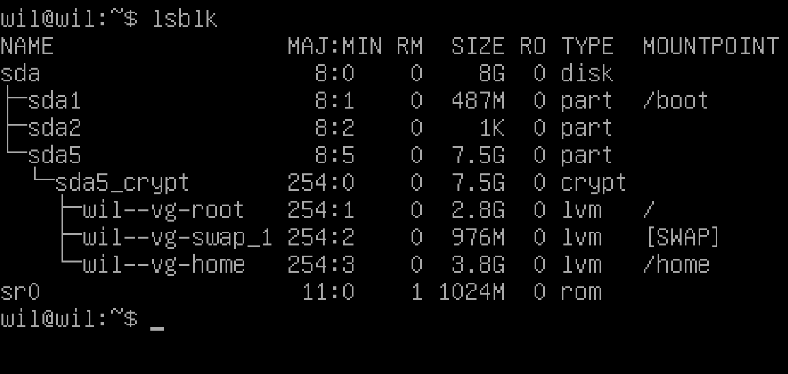

# Bornd2beRoot

## Основная цель проекта:

* Сконфигурировать и запустить свою Виртуальную Машину(ВМ).

## Общие рекомендации

* Используйте **VirtualBox** или **UTM**
* В корне репозитория должен быть только файл `signature.txt` с подписью диска моей ВМ (Подробнее в разделе "Защита
  проекта").

## Обязательная часть

`!!! Запрещено использовать X.org или любые другие графические серверы`

`
Рекомендуется использовать последнюю стабильную версию Debian или CentOS
`

* Если выберешь [CentOS](https://ru.wikipedia.org/wiki/CentOS) нужно будет настроить:
    * Не нужно настраивать [KDump](https://habr.com/ru/company/selectel/blog/226487/)
    * [SELinux](https://ru.wikipedia.org/wiki/SELinux) должен запускаться при старте и быть настроен согласно
      требованиям проекта
    * [AppArmor](https://ru.wikipedia.org/wiki/AppArmor) должен запускаться при старте и быть настроен согласно
      требованиям проекта

---

### VirtualMachine:

* `hostname` ВМ - `cmissy42` (логин42)
    * Во время защиты `hostname` нужно будет изменить
* ВМ должна содержать как минимум **2 зашифрованных раздела**
    * Для этого использовать [LVM](https://ru.wikipedia.org/wiki/LVM) - (logical volume manager) менеджер логических
      томов
    * Пример деления на разделы 
        * При защите будет несколько вопросов например:
            * [разница между aptitude и apt](https://qastack.ru/server/21105/whats-the-difference-between-apt-get-and-aptitude#:~:text=apt%2Dget%20%D0%B1%D1%83%D0%B4%D0%B5%D1%82%20%D1%85%D1%80%D0%B0%D0%BD%D0%B8%D1%82%D1%8C%20%D0%B8%D1%85,%D0%B2%D1%8B%20%D1%83%D0%B4%D0%B0%D0%BB%D0%B8%D1%82%D0%B5%20%C2%AB%D0%BE%D1%81%D0%BD%D0%BE%D0%B2%D0%BD%D0%BE%D0%B9%C2%BB%20%D0%BF%D0%B0%D0%BA%D0%B5%D1%82.&text=aptitude%20%D0%B8%D0%BB%D0%B8%20apt%20%D1%84%D0%B0%D0%BA%D1%82%D0%B8%D1%87%D0%B5%D1%81%D0%BA%D0%B8%20%D0%BD%D0%B5,%D0%BF%D0%B0%D0%BA%D0%B5%D1%82%20%D1%83%D1%81%D1%82%D0%B0%D0%BD%D0%BE%D0%B2%D0%BB%D0%B5%D0%BD%20%D0%B2%D1%80%D1%83%D1%87%D0%BD%D1%83%D1%8E%20%D0%B8%D0%BB%D0%B8%20%D0%B0%D0%B2%D1%82%D0%BE%D0%BC%D0%B0%D1%82%D0%B8%D1%87%D0%B5%D1%81%D0%BA%D0%B8.)
            * Что такое [SELinux](https://ru.wikipedia.org/wiki/SELinux)
              или [AppArmor](https://ru.wikipedia.org/wiki/AppArmor)
            * Нужно понимать чем пользуешься и тд...
* `SSH` должен работать только на порту `4242`, подключение по SSH как `root` должно быть запрещено из соображений
  безопасности
* `Firewall` должен запускаться при старте ВМ
    * Для [CentOS](https://ru.wikipedia.org/wiki/CentOS) нужно
      использовать [UFW](https://help.ubuntu.ru/wiki/%D1%80%D1%83%D0%BA%D0%BE%D0%B2%D0%BE%D0%B4%D1%81%D1%82%D0%B2%D0%BE_%D0%BF%D0%BE_ubuntu_server/%D0%B1%D0%B5%D0%B7%D0%BE%D0%BF%D0%B0%D1%81%D0%BD%D0%BE%D1%81%D1%82%D1%8C/firewall)
      вместо дефолтного Firewall
        * Для
          установки [UFW](https://help.ubuntu.ru/wiki/%D1%80%D1%83%D0%BA%D0%BE%D0%B2%D0%BE%D0%B4%D1%81%D1%82%D0%B2%D0%BE_%D0%BF%D0%BE_ubuntu_server/%D0%B1%D0%B5%D0%B7%D0%BE%D0%BF%D0%B0%D1%81%D0%BD%D0%BE%D1%81%D1%82%D1%8C/firewall)
          понадобится [DNF](https://ru.wikipedia.org/wiki/DNF_(%D0%BC%D0%B5%D0%BD%D0%B5%D0%B4%D0%B6%D0%B5%D1%80_%D0%BF%D0%B0%D0%BA%D0%B5%D1%82%D0%BE%D0%B2))

---

### Security policy

* Реализовать `Strong password policy`
    * Срок жизни пароля 30 дней
    * Интервал между сменой паролей должен быть не меньше 2х
      дней [пример](https://www.unixmen.com/password-management-linux-using-chage/)
    * Валидация пароля
        * Не короче 10 символов
        * Должен содержать, как минимум, **одну букву в апперкейсе** и одну **цифру**
        * Не должен содержать больше 3х повторяющихся символов
        * Не должен содержать имени пользователя
        * Новый пароль должен содержать не меньше 7 символов которых небыло в прошлом пароле
            * исключение `root`
        * `root` пароль должен соблюдать все политики кроме тех, которые явно исключены
* Чтобы установить `strong configuration` для `sudo` группы нужно:
    * Аутентификация с `sudo` не больше 3х попыток воода пароля
    * После того как попытки ввода пароля исчерпаны должно всплывать сообщение (текст на усмотрение пользователя)
    * Каждое действие `sudo` должно логироваться в файл `/var/log/sudo/` (input и output)
    * Нужно использовать [TTY](https://zalinux.ru/?p=4490) режим из соображений безопасности
    * `sudo` должен работать только в ограниченном наборе путей
        * например: `/usr/local/sbin:/usr/local/bin:/usr/sbin:/usr/bin:/sbin:/bin:/snap/bin`
* Установить и настроить `sudo` следуя строгим правилам (хз что имеется ввиду)
* Вместе с `root` пользователем должен быть еще пользовател с моим логином `cmissy`
    * Этот пользователь лолжен принадлежать к группам `user42` and `sudo`
    * Во время защиты нужно будет создать еще одного пользователя и назначить ему группу
* После настройки всех конфигов нужно поменять пароли всех пользователей в том числе `root`

---

### Bash script "monitoring.sh"

* При запуске ВМ и каждые 10 минут должен отобразить на всех терминалах некотурую информацию (take a look at wall - что
  это значит???).
    * Баннер - опционально
    * Никаких ошибок не должно быть видно
* Список информации которую должен показывать скрипт:
    * Архитектура ОС и версия ее ядра
    * Количество физических процессов
    * Количество виртуальных процессов
    * Текущий процент использования оперативы
    * Текущий процент использования памяти
    * Текущий процент использования процессоров
    * Дата и время последнего запуска
    * Активен [LVM](https://ru.wikipedia.org/wiki/LVM) или нет
    * Количество активных подключений
    * Количество пользователей использующих мой сервер
    * IPv4-адрес сервера и его MAC-адрес
    * Количество команд выполненных с `sudo`

```
During the defense, you will be asked to explain how this script
works. You will also have to interrupt it without modifying it.
Take a look at cron.
```

---

# Checklist

- [ ] General instructions
- [ ] Project overview
    - [ ] Как работает ВМ
    - [ ] Какую ОС выбрал и почему
    - [ ] Разница между CentOS и Debian
    - [ ] Для чего нужна ВМ
    - [ ] Для выбравших Debina: объяснить aptitude apt, APPArmor
- [ ] Simple setup
    - [ ] Убедиться что нет графического интерфейса, подключитесь не под root
    - [x] Проверить работу UFW и рассказать что это
    - [x] Проверить работу SSH и рассказать что это
    - [x] Проверить чтобы ОС была Debian или CentOS
- [ ] User
    - [ ] Показать своего пользователя и что он входит в группу "user42"
    - [ ] Проверить настройку политики паролей
        - [ ] создать пользователя
        - [ ] попробовать присвоить ему все возможные невалидные пароли
        - [x] показать в каких файлах это конфигурируется
    - [x] создать группу "evaluating" и прикрепить нового пользователя к ней
    - [x] объяснить преимущества этой политики
- [ ] Hostname and partitions
    - [x] проверить hostname на шаблон "login42"
    - [x] поменять hostname. "имя_проверяющего42". перезагрузить (должно поменяться)
    - [x] вернуть прежний hostname
    - [ ] рассказать как посмотреть деление дисков в ВМ (рассказать про LVM, что показывает)
    - [x] сравнить деление с примеров в сабджекте
- [ ] Sudo
    - [x] проверить что sudo установлен на ВМ
    - [x] назначить нового пользователя в группу sudo
    - [ ] показать правила для sudo и рассказать **принцип работы**
    - [ ] показать выполнение правил для sudo
    - [x] проверить существует ли файл для хранения логов sudo
    - [x] проверить логирование sudo
- [x] UFW
    - [x] проверить что UFW установлена на ВМ
    - [x] проверить что работает корректно
    - [x] объяснить что такое UFW и зачем он нужен
    - [x] показать список активных правил, он должен содержать правило для порта 4242
    - [x] добавить правило для 8080
    - [x] удалить
- [ ] SSH
  - [x] проверить что ssh установлен
  - [x] проверить что работает
  - [ ] рассказать что такое [ssh](https://ru.wikipedia.org/wiki/SSH) и зачем
  - [ ] убедиться что SSH использоует только порт 4242
